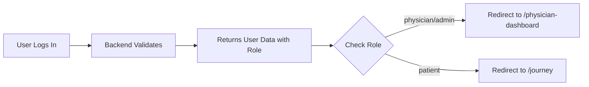

# Quick Reference: Physician Login

## ✅ System Status

**Role-Based Authentication**: ACTIVE ✅  
**Database**: Migrated and Ready ✅  
**Physician User**: Configured ✅  

## 🔑 Physician Login

### Credentials
- **Username**: `physician`
- **Password**: (your physician password)
- **Login URL**: http://localhost:3000/login

### Expected Behavior
1. Enter physician credentials
2. Click "Login"
3. **Automatic redirect to**: http://localhost:3000/physician-dashboard

## 👥 Current Users

| Username  | Role      | Redirect After Login           |
|-----------|-----------|--------------------------------|
| physician | physician | `/physician-dashboard`         |
| Martin    | patient   | `/journey`                     |
| Martin2   | patient   | `/journey`                     |

## 🧪 Test It Now

### Test 1: Physician Login
```bash
# 1. Make sure servers are running
# Backend: http://localhost:3001
# Frontend: http://localhost:3000

# 2. Go to login page
open http://localhost:3000/login

# 3. Login with physician credentials
# Expected: Redirect to /physician-dashboard
```

### Test 2: Patient Login
```bash
# 1. Go to login page
open http://localhost:3000/login

# 2. Login with patient credentials (Martin)
# Expected: Redirect to /journey
```

## 🔧 How It Works



## 📊 What Changed

### Database
- ✅ Added `role` field to users table
- ✅ Added `by_role` index
- ✅ Migrated all existing users to "patient"
- ✅ Set physician user to "physician" role

### Backend
- ✅ Login endpoint now returns `role` field
- ✅ Defaults to "patient" if role not set

### Frontend
- ✅ Login page checks `response.user.role`
- ✅ Redirects based on role (not username string)
- ✅ TypeScript interfaces updated

### New Functions
- `setUserRole({ userId, role })` - Set role by ID
- `setRoleByUsername({ username, role })` - Set role by username
- `getUsersByRole({ role })` - Get all users with a role
- `migrateUserRoles({})` - Migrate users to default role

## 🚀 Quick Commands

### Check Current Roles
```bash
npx convex run users:getAllUsers
```

### Set a User to Physician
```bash
npx convex run users:setRoleByUsername '{"username": "your_username", "role": "physician"}'
```

### Re-run Migration
```bash
cd "/Users/martinkawalski/Documents/1. Projects/15-Day Test"
NEXT_PUBLIC_CONVEX_URL="https://enchanted-terrier-633.convex.cloud" node scripts/setup-physician-user.js
```

## 🎯 Next: Protect Physician Dashboard

The physician dashboard currently has no role checks. To secure it:

```typescript
// Add to physician dashboard layout
'use client';

import { useEffect } from 'react';
import { useRouter } from 'next/navigation';

export default function PhysicianLayout({ children }) {
  const router = useRouter();
  
  useEffect(() => {
    const user = JSON.parse(localStorage.getItem('user') || '{}');
    if (user.role !== 'physician' && user.role !== 'admin') {
      router.push('/login');
    }
  }, [router]);
  
  return children;
}
```

## 📝 Files Modified

- `convex/schema.ts` - Added role field
- `convex/users.ts` - Added role management
- `server/routes/auth.js` - Return role in login
- `client/lib/api.ts` - Updated User interface
- `client/app/login/page.tsx` - Role-based redirect

---

**Ready to Test!** 🎉

Try logging in now with the physician account to verify the redirect works correctly.


