---
pdf_options:
  format: Letter
  margin: 10mm
stylesheet:
---

# Zoé Sleep App — Setup Guide
**Longevity Retreat, Half Moon Bay | January 16-18, 2025**

---

**A Note Before You Begin**

This is not a passive sleep tracker. This is your **personal hybrid digital-human sleep clinic experience.**

If it feels like work — good. It is. You're working on your sleep.

I aim to be scientifically accurate. The validated clinical instruments we're using require this level of engagement. There are no shortcuts. The burden is the point.

**Yes, it's hard work. But it's only 10 days.** After that, it gets easier. We move from assessment into the prescription phase — where you'll receive your personalized sleep protocol and the app shifts to supporting your improvement journey.

At the end, you won't get a generic report — you'll get my personal analysis and a protocol designed specifically for you.

**Ten days. Ten minutes a day. Your sleep is worth it.**

---

## Quick Setup (5 Minutes)

1. Install **TestFlight** from the App Store: [apps.apple.com/app/testflight](https://apps.apple.com/app/testflight/id899247664)
2. Open the Zoé Sleep invite: **[testflight.apple.com/join/62aRAuVH](https://testflight.apple.com/join/62aRAuVH)**
3. Install Zoé Sleep, create account, complete onboarding
4. Follow the 6-step guided tour
5. Tap your **initial (top-right)** → **Health Data Settings** → **Sync Health Data**
6. **Apple Watch users:** Open app on both devices → tap **Sync Now**

**Done.** Complete Sleep Log + Assessment daily for 10 days.

## Step 1: Install TestFlight & Zoé Sleep

Download **TestFlight** from the App Store: [apps.apple.com/app/testflight](https://apps.apple.com/app/testflight/id899247664)

Then open the Zoé Sleep invite link: **[testflight.apple.com/join/62aRAuVH](https://testflight.apple.com/join/62aRAuVH)**

Tap **Accept**, then **Install**.

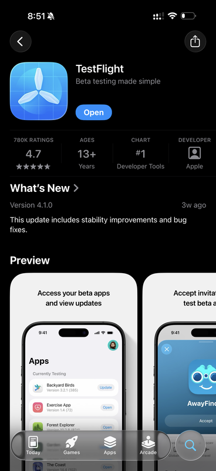 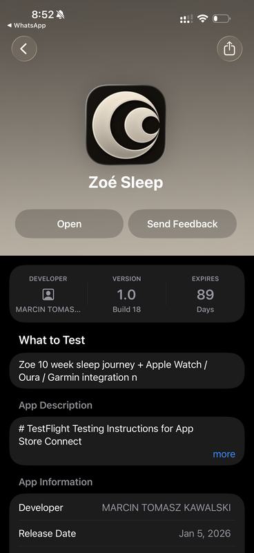

## Step 2: Create Account & Onboarding

Sign up with email or Apple ID:

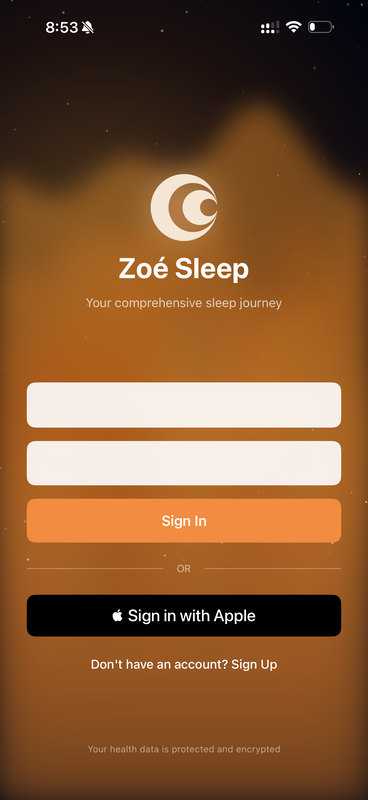 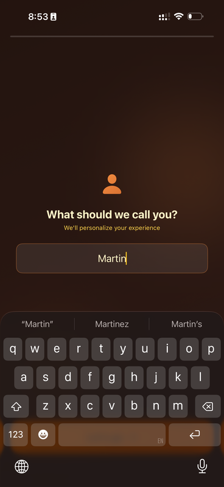

The app will guide you through onboarding — it will ask about your **height, weight, gender, and age**:

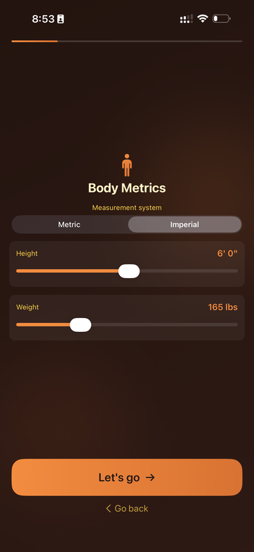

Allow HealthKit access when prompted (this grants permission — the actual data sync happens later).

## Step 3: Guided Tour

After onboarding, you'll land on the main dashboard. The app automatically enters **tutorial mode** — a 6-step guided tour explaining each screen element.

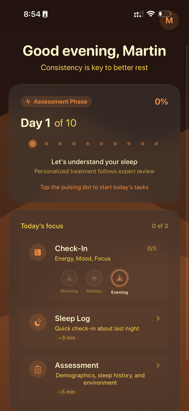 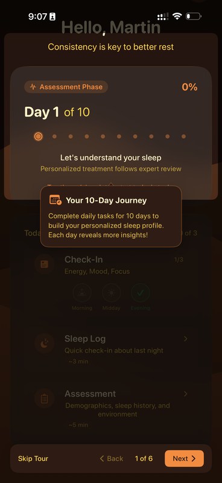

Follow along and tap **Next** to proceed through all 6 steps. The tour explains your daily tasks: Check-In, Sleep Log, and Assessment.

---

### Step 4: Sync Your Health Data — Critical!

After the tour, tap your **initial** (top-right) → **Health Data Settings** → **Sync Health Data**

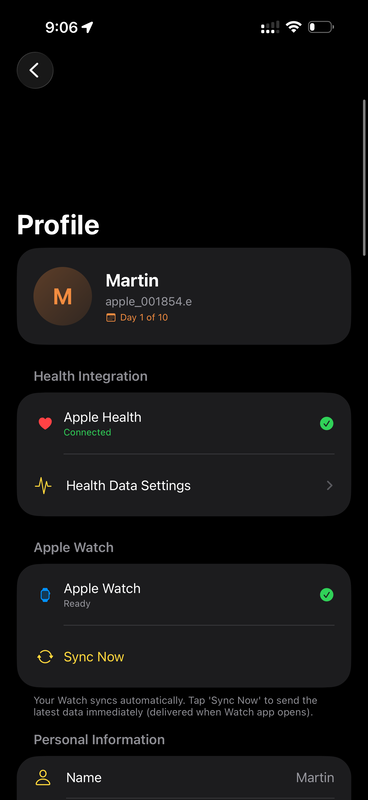 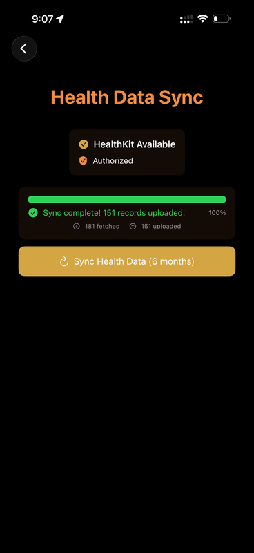

This imports data from Apple Watch, Oura, Garmin, Whoop — any device syncing to Apple Health.

## Apple Watch Users Only

The Zoé Sleep Watch app installs automatically when you install the iPhone app.

**To sync iPhone ↔ Watch:** Both apps must be open at the same time. Then in iPhone Settings, tap **Sync Now**.

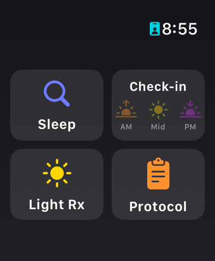 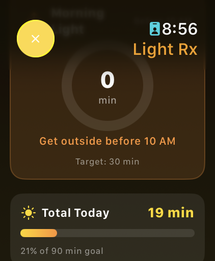

**Watch features:**
- **Check-in:** Use the Digital Crown to quickly rate energy/mood/focus
- **Light Rx:** Track morning light exposure (aim for 30 min before 10 AM)

Light exposure is the strongest driver of circadian rhythm. Check your progress throughout the day.

## Your Daily Routine

For 10 days, complete these each morning:

| Task | Time | Required |
|------|------|----------|
| Sleep Log | ~3 min | Yes |
| Assessment | ~5 min | Yes |
| Check-ins (3x) | 30 sec | Optional |

### Sleep Log

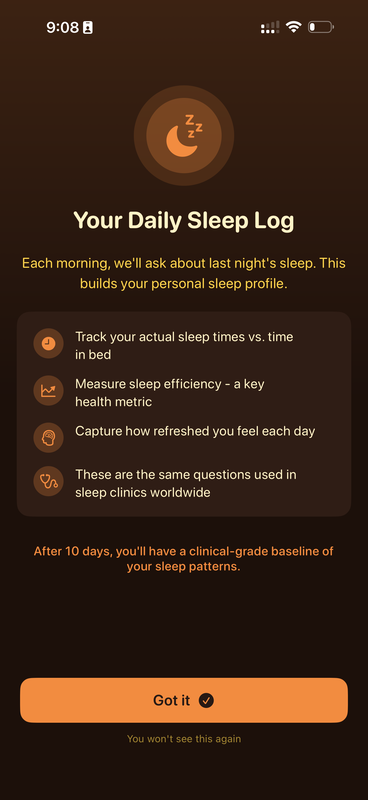 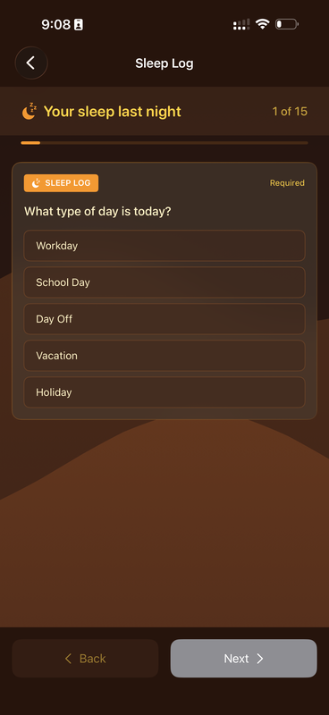

Based on the Stanford Sleep Log. Answer from **subjective memory** — don't check your wearable first! The gap between perception and reality is clinically valuable.

### Assessment

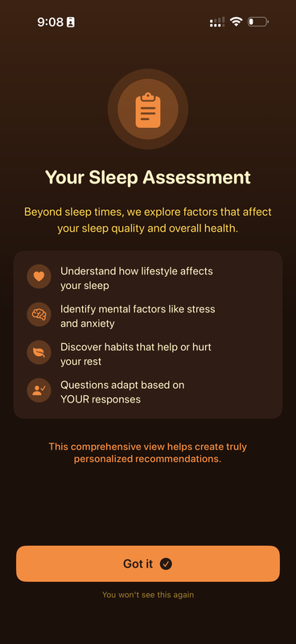

**Days 1-5:** Core questions (similar for everyone)
**Days 6-10:** Personalized deep dives based on your answers (insomnia, sleep apnea, shift work, etc.)

### Daily Lockout

App locks after daily tasks complete, unlocks at **4:00 AM** next day. This ensures data quality.

## Settings Menu

Tap your initial (top-right) to access settings:

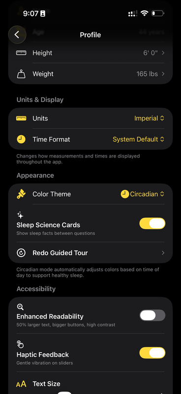

| Setting | Description |
|---------|-------------|
| Health Data Settings | Sync wearable data |
| Personal Information | Review/edit profile |
| Color Theme | Circadian mode adjusts by time of day |
| Sleep Science Cards | Toggle educational cards during assessments |
| Debug Mode | Experimental features (not fully tested) |

---

## After 10 Days

I'll personally analyze your sleep profile and questionnaire responses. At the retreat, we'll review your results together and I'll assign a personalized sleep improvement protocol.

**Tips:** Be consistent (same time each morning) · Don't peek at wearable data before Sleep Log · Don't skip days — bad nights are valuable · Get morning light

---

## Questions? Contact Me

- **Email:** [kawalski@stanford.edu](mailto:kawalski@stanford.edu)
- **iMessage:** +1 (650) 705-9311
- **WhatsApp:** +41 78 753 3505

*See you in Half Moon Bay.*
